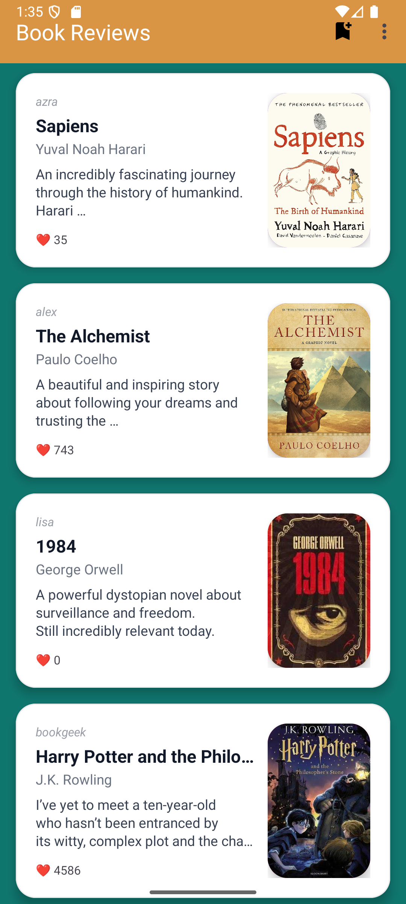

# 📚 Book Review Android App

An Android application where users can share book reviews, upload book covers, and interact with other users' posts.

The app allows users to create an account, add books with reviews, view other users' posts, and like their favorite books.

---

## 🚀 Features

* User authentication with **Firebase Authentication**
* Share books with **title, author, and review**
* Upload **book cover images**
* View books in a **RecyclerView feed**
* Like books shared by other users
* Book detail screen with full review
* Delete book posts (only by the owner)
* Modern Android UI design

---

## 🛠 Technologies Used

* **Kotlin**
* **Firebase Authentication**
* **Firebase Firestore**
* **MVVM Architecture**
* **RecyclerView**
* **ViewBinding**
* **Material Design Components**

---

## 📱 Screenshots

### Login Screen


### Create Account


### Book Feed




### Book Detail


### Add Book


---

## 📂 Project Structure

```
android-book-review-app
│
├── app
│   ├── data
│   ├── view
│   ├── viewmodel
│   └── adapter
│
├── screenshots
│
└── README.md
```

---

## 👩‍💻 Author

**Begüm Şara Ünal**

Junior Android Developer

---

## 📌 Notes

This project was developed as a portfolio project to demonstrate Android development skills including Firebase integration, MVVM architecture, and modern UI design.
